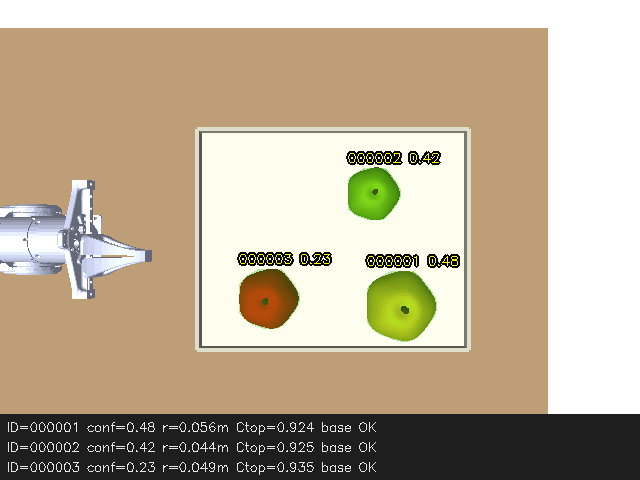

# 탑뷰 구현 검증 기록 — 2026-10-02

PiPER 공식 URDF + 고정 eye-to-hand RGB-D 렌더 → 실제 YOLOv8-seg → 표면 점군/근사 구
→ capture-time tf2 → Apple ID → 관측/crop/Mask/방향/원형도 출력의 기본 통합 경로를 실행했다.
물리 카메라, 로봇 CAN/enable/command, 품질 판정, MoveIt는 실행하지 않았다.
모든 장면/모델에서 인식 정확도가 검증됐다는 의미는 아니다. 아래 실패를 그대로 남겼다.

## 빌드·단위·계약 검증

- `.venv/bin/python -m colcon build --symlink-install`: 3개 패키지 빌드 성공.
- `colcon test-result --verbose`: **41 tests, 0 errors, 0 failures, 0 skipped**.
  기존 20개 테스트와 새 기하/추적/ROS/저장/렌더 계약 테스트 21개다.
- 순수 투영식, raw 역왜곡, optical→base 부호, 방향벡터 norm, 2D 원/타원/경계/작은 Mask,
  작은 공극만 채우는 규칙, noisy cap/outlier 구 피팅, 평면/얕은 cap 무효화, depth 단위/dtype,
  ROI crop 정합, 중복/순서/누락/추가/TTL/frame 변경/시간 역행 tracker를 검사했다.
- 실제 ROS 메시지/DDS를 사용한 **분할 대역 테스트**에서 crop/stamp/validity/JSON null,
  RGB-only 무내참수 입력, 실보정 미확인, TF 누락, 잘못된 단위/frame, 오래된 입력/느린 추론을
  검사했다. 이는 실제 YOLO 검증으로 세지 않는다.
- tf2 Buffer에 서로 다른 시각의 dynamic TF를 넣어 capture-time interpolation과 역변환을
  검사했고, 미래 시각의 extrapolation 오류가 최신 TF로 바뀌지 않음을 확인했다.
- Bullet sensor test에서 실제 tray plane 렌더 Depth가 설치 거리와 2 mm 이내로 일치했다.
  이 테스트도 learned segmentation E2E를 대체하지 않는다.
- `flake8`, Python compileall, `bash -n`, `git diff --check` 통과.
- detection checkpoint `yolov8n.pt`를 새 Segmenter에 실제 전달해
  `Expected segmentation checkpoint; got detect` 오류를 확인했다.
- snapshot 최소 간격/요청/최대 batch와 PNG/JSON null 저장을 테스트했다.

## 실제 모델·센서·ROS 통합 실행

기본 `scene.yaml`: 서로 다른 크기/색의 procedural apple mesh 3개, PiPER 공식 STL,
테이블/트레이/벽, 카메라 640×480 / vertical FOV 50° / 높이 .85 m.
TinyRenderer의 실제 RGB/Depth만 모델/기하 노드에 전달했다. instance ID 렌더 buffer는 사용하지
않았고, 사과 정답은 별도 evaluator/probe만 읽었다.
사과는 완전한 구가 아니며 생성 `radius_m`은 mesh의 radial shape parameter다.

허용오차는 실행 **전** `asac_sim/evaluation.py`에 설정했다:

| 형상 | 중심 허용오차 | 반지름 허용오차 |
|---|---:|---:|
| 구 | 8 mm | 5 mm |
| 사과 mesh의 근사 구 | 15 mm | 8 mm |

매칭 gate 80 mm, 최소 유효 정답 매칭 비율 .8, 기본 정확도 case에서 ID switch 0을 요구했다.
이는 배포/파지 정확도 보장이 아니며 이 장면용 평가 기준이다.

기본 nano 모델의 최초 15초 독립 ROS evaluator:
66 capture, 정답 198개와 모두 매칭, ID switch 0,
processing median .1003 s / max .1558 s. 원본 결과는 `runs/topview/ros-baseline.json`.

마지막 변경 후 10초 launch/probe(워밍업·DDS discovery 포함):
**31 capture / 93 사과 관측**, 유효 중심과 반지름 모두 매칭, ID switch 0,
중심 최대 오차 **8.054 mm**, 반지름 최대 오차 **4.011 mm**,
processing median **.1037 s**, max **.1482 s**.
31개의 overlay/MarkerArray 수신과 crop header/ROI 크기 계약을 확인했다.
이 처리 시간은 inference+geometry/TF/association 준비 시간이며 장기 FPS 보장값이 아니다.
launch의 최대 inference 시작 주기는 5 Hz로 제한되어 있다.

실제 capture stamp의 TF 조회 결과:

```json
{"target":"base_link","source":"asac_sim_camera_optical_frame",
 "translation":[0.4,0.0,0.85],"quaternion_xyzw":[1.0,0.0,0.0,0.0]}
```

static TF이므로 transform 자체 stamp=0은 정상이다. 조회 시각은 RGB의 nonzero capture stamp다.
`tf2_echo`에서도 X 유지/Y·Z 반전과 translation 방향을 확인했다.

## 장면 변경·오류 주입 결과

동일 nano checkpoint / 동일 confidence .20으로 각 case를 별도 10초 실제 ROS launch 실행했다.
아래의 매칭은 **유효 3D 중심+반지름**을 독립 정답과 연결한 비율이며 학습 데이터셋 recall이 아니다.

| Case | Capture | 결과 |
|---|---:|---|
| 기본 3개 사과 | 32 | 매칭 100%, ID switch 0, 통과 |
| 위치·크기 변경 | 21 | 매칭 100%, 중심 max 8.578 mm / radius max 4.188 mm, 통과 |
| RGB 매 3번째 프레임 누락 | 26 | 매칭 100%, ID switch 0, 통과 |
| 사과 1개 | 32 | nano 검출 없음, **정확도 실패** |
| 구 1개 | 35 | nano 검출 없음, **YOLO E2E 실패**; 구 모델 오차는 측정 못 함 |
| 겹침 | 27 | 유효 매칭 33.3%; 전체 개별 사과 인식 미완료 |
| 부분 가림 | 24 | 유효 매칭 66.7%; 가려진 사과가 누락됨 |
| 사과 제거·새 객체 추가 | 32 | 유효 매칭 88.4%, ID switch 1; 지속 ID 보장 실패 사례 기록 |
| Depth 100% 구멍 | 28 | center/radius/direction null + `insufficient_valid_depth`, 안전 처리 통과 |
| 미보정 내참수 | 36 | 2D 결과만, metric 무효 + `invalid_rectified_projection_matrix`, 통과 |
| Depth 단위 ×1000 | 30 | metric 모두 무효, 통과 |
| camera TF 누락 | 23 | camera 기하는 유지, base/direction null + tf lookup 원인, 통과 |
| input stamp 3 s 지연 | 0 | 정상 관측 배열 없음, `stale_or_future_input`, 통과 |
| optical frame 변경 | 29 | 변경 후 camera/base 기하·radius/direction null과 frame 원인, 통과 |

small 모델 `yolov8s-seg.pt`로 **별도** 단일 사과 case를 재실행했다:
32 capture, 유효 매칭 100%, ID switch 0, 중심 max 7.473 mm / radius max 3.761 mm,
processing median .1879 s. small 모델은 기본 3개 장면의 오프라인 점검에서 1개만 검출했고,
실제 ROS 겹침 장면에서는 검출이 없었다. nano/small 결과를 합쳐서 한 모델의 성공으로
표현하지 않는다. 추가로 m 모델도 오프라인 조사했지만 전체 장면 개선은 확인되지 않아
기본 실행 모델로 채택하지 않았다.

구 피팅의 noisy synthetic point cap 테스트는 1.5 mm 허용오차 안에서 통과했다.
이는 RGB의 구를 YOLO가 사과로 검출했다는 뜻이 아니다. 구 모델 E2E 오차는 null이며,
사과 mesh 근사 오차와 구 기하 단위 결과를 구별했다.

E2E runner의 `report` case(가림·겹침·lifecycle)는 `passed=null`로 관측 결과를 보고한다.
정확도/안전 요구 case가 실패하면 마지막 summary와 함께 종료코드 1을 반환한다.
현재 nano 전체 case는 단일 사과/구 인식 실패 때문에 1이 예상된다.

## RViz·토픽·rosbag

RViz 11.2.29를 실제 launch로 실행했다. OpenGL 4.2 초기화와 official PiPER mesh 로드를
확인했다. 초기 absolute mesh URI와 ROS 1식 Marker property 이름 문제는 재실행 중 찾아
`file://` mesh URI와 Humble의 `Topic` property로 수정했다.
최종 DDS 확인에서 RViz가 `/asac/overlay`, `/asac/markers`, `/asac_sim/scene_markers`를
각 1개씩 실제 구독했다. tf2/robot description도 연결된다.
WSL의 Qt/X11 화면 캡처는 검은 영상만 반환했으므로 GUI screenshot으로 장면을 눈으로
검증했다고 주장하지 않는다. ROS로 받은 overlay는 직접 확인했고 아래 자산으로 남겼다.



5초 제한 rosbag 기록(`--use-sim-time`)과 simulator 없이 별도 domain에서 playback(`--clock`)도
실행했다. `/tmp/asac-topview-record`는 약 4.648 s / 72 MiB / 176개 메시지다.
RGB 43, Depth 29, CameraInfo 51, TF 51, static TF 2개를 기록했다.
best-effort 큰 영상 메시지 수가 같지 않아 전 프레임 보존은 확인되지 않았다.
재생에서는 18개 capture의 사과 54개가 모두 유효 base 관측으로 출력됐다.
bag record의 wall clock과 sim header를 혼용하면 stale이 되므로 실행 안내에
`--use-sim-time`을 명시했다. bag은 /tmp에 보존했고 Git에는 큰 영상 데이터를 넣지 않았다.

## 재현 자산과 변경 파일

Git에 보존할 작은 검증 자산:

- [수치/성공·실패 결과 JSON](verification/topview/results.json)
- [실제 기본 관측 전체 metadata](verification/topview/baseline-sample.json)
- [Depth 구멍의 null/validity 샘플](verification/topview/depth_holes-sample.json)
- [Python 패키지 버전 기록](verification/topview/python-environment.txt)
- [ROSbag 재생 결과](verification/topview/bag-replay-result.json)

큰 실행 자산: `runs/topview/e2e`, `e2e-small`, `final`, `release`의 case별 scene YAML,
launch.log, crop RGB/Mask PNG, overlay.png, sample.json/result.json.
`runs/topview/rviz-final.log`, `bag-replay-node.log`, `bag-replay-player.log`도 보존했다.
카메라/인식 프로세스는 검증 종료 후 중지한다.
연속 SIGINT와 shutdown 중 callback 발행 문제도 보완했고,
마지막 종료 시험에서 scene·robot_state_publisher·topview가 모두 정상 종료했다.

주요 생성·수정 파일:

| 파일/디렉터리 | 변경 |
|---|---|
| `src/asac_perception/asac_perception/{segmentation,geometry,observations,tracking,snapshots,topview_node}.py` | 분리된 처리 로직과 단일 인식 노드 |
| `src/asac_interfaces/msg/AppleObservation{,Array}.msg` | crop·Mask·PointStamped·기하·방향·validity 인터페이스 |
| `src/asac_perception/config/topview_real.yaml` / `launch/topview_real.launch.py` | 실제 카메라 입력·미보정 기본값 |
| `src/asac_sim/` | 공식 URDF/STL/라이선스, 실제 RGB-D scene, 평가, 통합 launch, RViz |
| `scripts/run_topview.sh`, `download_topview_models.py`, `inspect_model.py`, `verify_topview_e2e.py` | 실행·모델 검증·실제 모델 scenario 재현 |
| `test_topview_geometry.py`, `test_topview_ros.py`, `test_snapshots.py`, `asac_sim/test/test_render_contract.py` | 새 테스트 |
| 양쪽 기존 package.xml/setup.py 및 interfaces CMakeLists | 의존성과 entry point/message 등록 |
| `.github/workflows/ros2-humble.yml` | 새 단위 테스트에 필요한 SciPy/PyBullet 및 Humble 호환 pytest |
| `README.md`, `docs/TOPVIEW.md`, 이 기록 | 실행 및 검증 안내 |

기존 detector/depth/train, 기존 D455 launch/run script와 기존 사용자 변경은 덮어쓰지 않았다.
조사 시작의 Git 상태는 clean이었다. 원격 CI 실행은 수행/통과 확인하지 않았다.

## 환경·모델 출처와 남은 제약

OS Ubuntu 22.04.5 WSL2 / Python 3.10.12 / ROS 2 Humble.
Ultralytics 8.3.40 / torch 2.5.1+cpu / torchvision .20.1+cpu / NumPy 1.26.4 /
OpenCV 4.10.0 / SciPy 1.11.4 / PyBullet 3.2.7 / pytest 7.4.4 / setuptools 68.2.2.
ROS rclpy 3.3.22, tf2_ros_py .25.23, cv_bridge 3.2.1, message_filters 4.3.20,
RViz 11.2.29. Gazebo/GPU/CUDA를 사용하지 않았다. 시스템 패키지를 상속한 환경의
Matplotlib Axes3D warning이 로그에 있지만 이 경로는 Matplotlib 3D plot을 사용하지 않는다.

공식 assets v8.3.0의 YOLOv8n-seg / s-seg를 받아 task=segment와 model.names의 apple=47을
실제로 읽었다. SHA256은 `scripts/download_topview_models.py`에 고정하여 검증한다.
PiPER는 공식 humble commit `017ffefa64511bc6325bd77ddc4e16065c152051`의 복사본이다.
출처·라이선스는 [실행 안내의 출처](TOPVIEW.md#출처)에 기록했다.

현재 환경에서 물리 카메라와 검증된 eye-to-hand 보정값을 확보하지 못해 실제 RGB-only / RGB-D
장치 시험은 미실시다. RGB-only 어댑터와 미보정 base 무효화는 ROS 합성 입력 계약 시험까지
완료했다. 현장 검증에는 실카메라의 토픽 또는 rosbag, 보정 파일, 실제 camera/base frame이
필요하다. 사용한 COCO 가중치는 이 탑뷰 장면에 맞춰 학습한 모델이 아니며 가림·단일 사과·색·
조명에 대한 일반화가 미완료다. 최종 품질 등급·실제 파지 정확도·충돌 회피도 검증하지 않았다.
다음 실행 명령과 보정 설정은 [TOPVIEW.md](TOPVIEW.md)에 있다.
